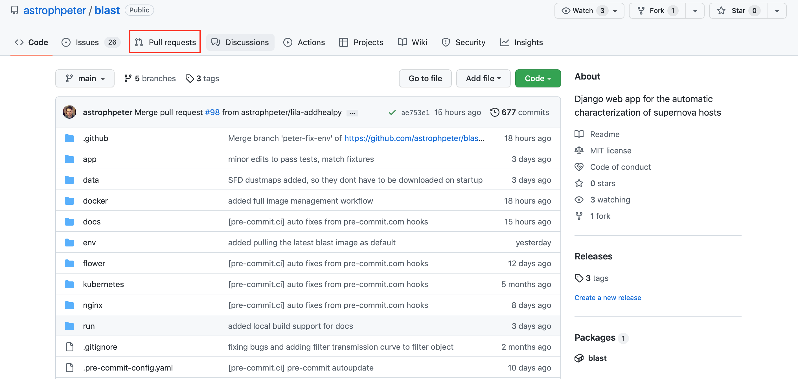
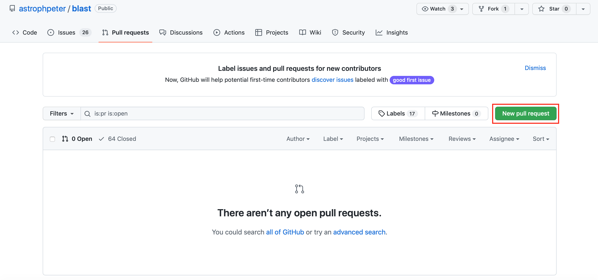
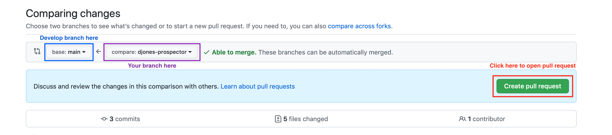
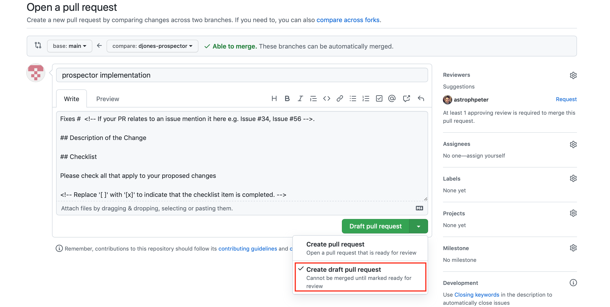
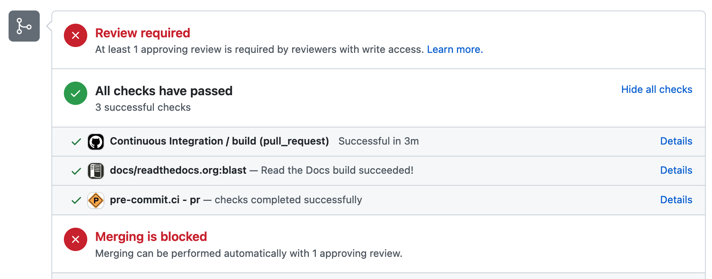
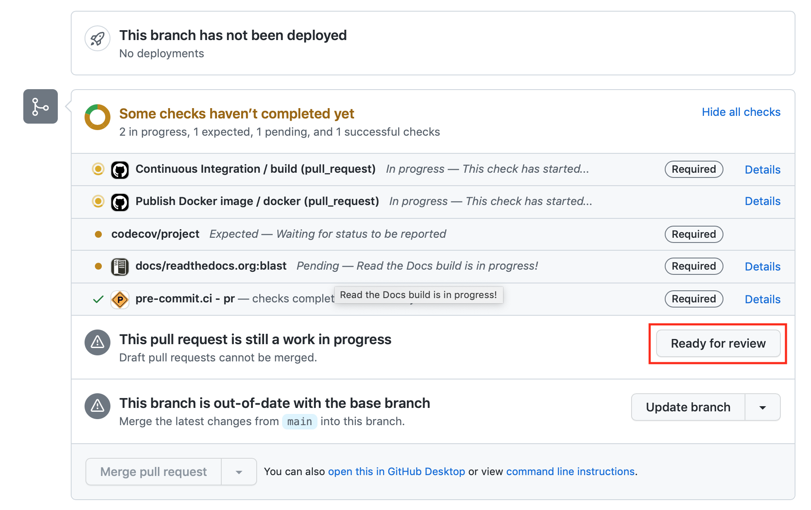

Developer workflow
==================

General workflow
----------------

To add or change code on Blast we use Git and GitHub. If you are unfamiliar with
these two pieces of software, a great place to start would be to watch this
introduction to Git and GitHub on YouTube
`here <https://www.youtube.com/watch?v=RGOj5yH7evk>`_.

The normal develop workflow of Blast is to branch off main, commit and push
changes, and then merge into the main branch with a pull request. Finally, after
the pull request has been approved and your changes have been merged you can delete
your branch.

Starting from scratch, the typical development workflow would be the following.

1. Clone the Blast Git repository

.. code:: none

    git clone https://github.com/scimma/blast.git

2. Create your own branch with the following naming convention.

.. code:: none

    git checkout -b <your first name>-<one or two word description of what you are doing>

For example, if you were called Joe and wanted to contribute to documentation on
Blast your branch might be called joe-docs.

3. Set the remote of your new branch to GitHub.

.. code:: none

    git push --set-upstream origin <your branch name>

This means you can push changes to GitHub where they can be saved before you
are ready for a pull request. Now you can make your changes and additions to the
code and push changes to GitHub.

4. Next go to to the Blast GitHub repository page and go to the pull requests tab.
Then open a new draft pull request.

5. Create a pull request with your branch and main.

6. Fill in the title and describe what you are trying to do in the description, and
open a draft pull request.

7. As you commit and push changes to your branch on GitHub they will show up
in the draft pull request. On every commit some checks will be performed on
your code, they are shown here:

The Continuous integration test checks if any of the code you changed failed
any of the Blast app tests. The checks from Read the Docs test if any of the code
you added broke the documentation build. Finally, the pre-commit test checks if
the code you added is correctly formatted. If it is not, pre-commit will
automatically fix things for you and push the changes. All the checks have passed
in the above screenshot and they should for your code changes if you want
them to be accepted!

When you are a happy for you changes to be reviewed
and then eventually merged into main, click ready for review.

Your code will now be reviewed and when it is accepted it will be merged into
main.

8. After your branch has been merged, delete the branch from your local
repository.

.. code:: none

    git branch -d <your branch name>

9. Then delete the branch from GitHub.

.. code:: none

    git push -d origin <your branch name>

To start work on a new feature, re-follow the developer workflow from step 2.
