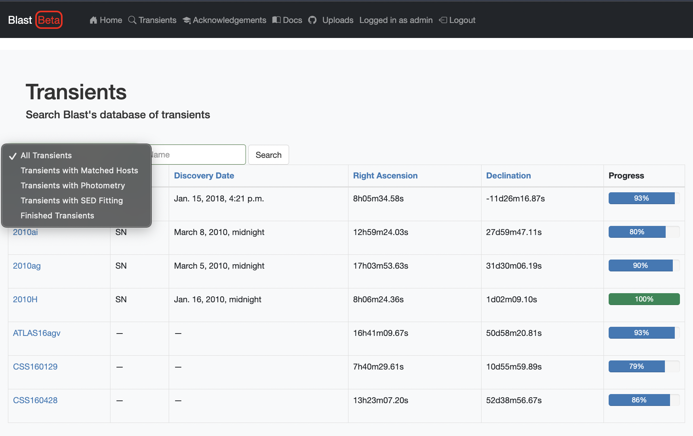
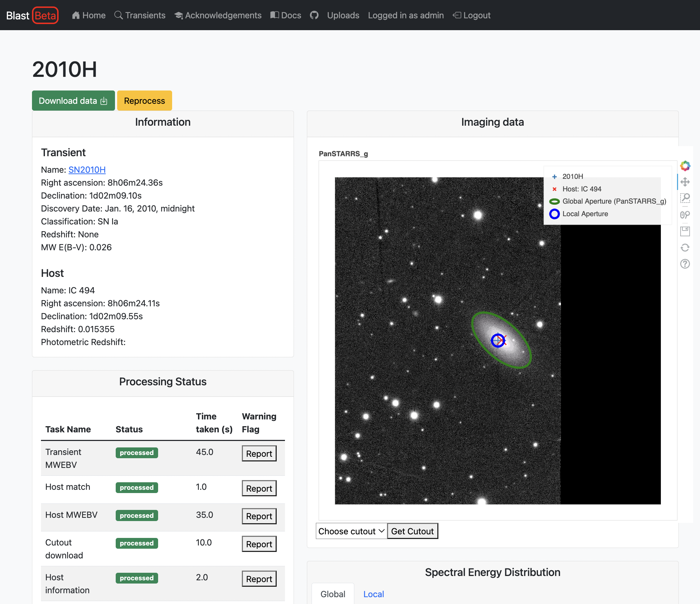
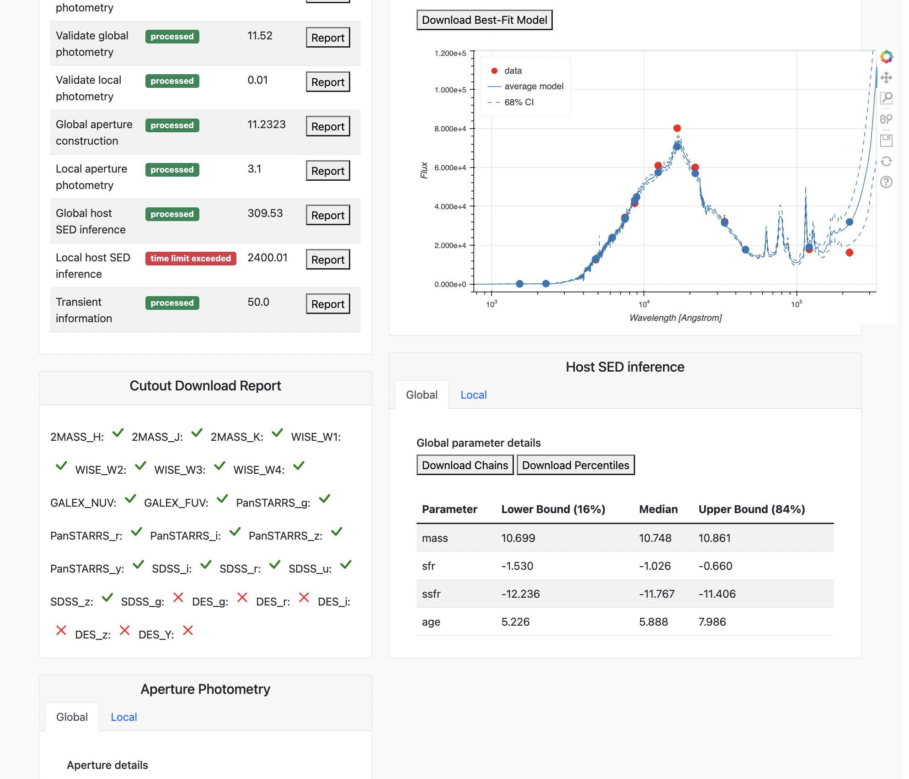
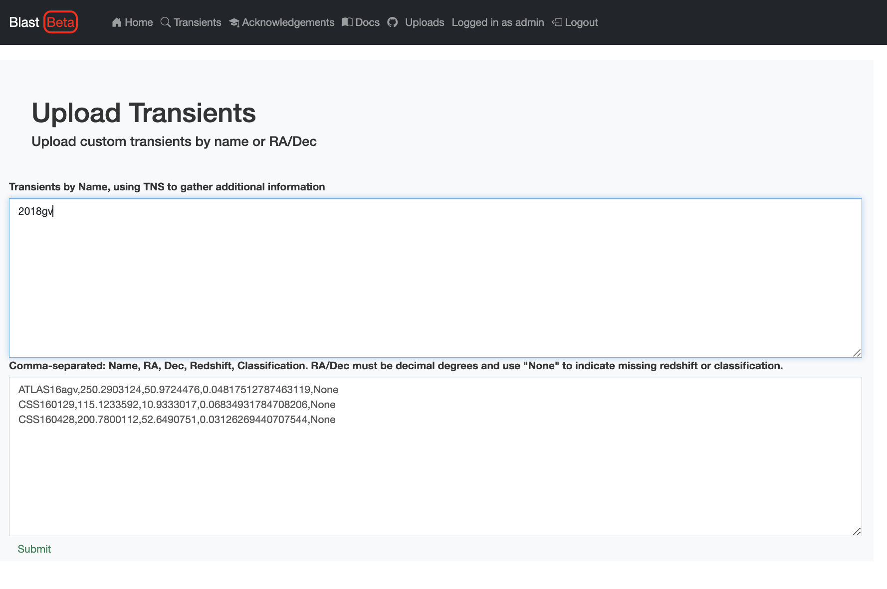

Web Pages
=========

Blast is a fairly simple interface, with basic pages that list transients, give details
for each transient, and allow authorized users to upload transients.  Details are given below.

List of Ingested Transients
---------------------------

The transient list page :code:`<blast_base_url>/transients`, contains
a simple list of ingested transients with links to the transient
information page for each one.  A user can sort the list by name
or by set of categories based on how much of the processing
status has completed successfully, using the search bar at the top of the
table (see below).

Individual Transient Pages
--------------------------

The individual transient pages list details of a given transient as well as its
downloaded cutout images, photometric apertures, photometry, and SED properties.  Cutout image and SED plots are interactive via Bokeh.  The status of a transient's processing is given as well, and users can use the "Report" button to flag if a stage has yielded suspect results (for example, a poor estimation of isophotal aperture radius, or a SED model that does not fit the data).  The goal of this button is to help users avoid suspect results, but there is no need to flag stages that already have a "failed" status.

Downloading data
++++++++++++++++

For all metadata associated with each transient, the :code:`Download Data` button near the top of the page links to the Django REST API, and can be accessed programmatically.  See the :ref:`api` for additional information on each column as well as how to execute queries on individual database tables via the API.

To download files with 1) parameter estimation chains, 2) parameter confidence intervals, and 3) best-fit models and uncertainties, the page includes "Download Chains", "Download Percentiles", and "Download Best-Fit Model" links.  These files are in :code:`.npz` format and can be read with :code:`np.load`.  Parameters correspond to the Prospector-alpha model, with details given `here <https://arxiv.org/abs/1609.09073>`_.  To do these downloads programatically, see :ref:`sedfittingresult`.

Authorized Users
----------------

Users with a Blast account can upload custom transients and
re-start the processing for a given transient that might have
failed in a way that can be fixed be re-running things (for
example, if an image cutout server was offline).  If an
account on Blast is necessary for your science, please
email David Jones (dojones@hawaii.edu) or create a GitHub issue.

Uploading New Transients
++++++++++++++++++++++++

A link to the transient upload page, :code:`<blast_base_url>/uploads` will
appear in the toolbar at the top of the page for authorized users.  Users
can input a list of transients by ID to be imported from the Transient
Name Server (TNS), or they can manually specify, via comma-delimited list,
a transient's name, RA, dec (both in decimal degrees), redshift, and
type (SN Ia, for example).  Redshift and type are optional but
recommended; write "None" if you do not have this information.

Restarting Processing
+++++++++++++++++++++

Near the top of each transient list page, authorized users will see a yellow buttom labeled "Reprocess."  Clicking this button will set all task statuses to "unprocessed" for the given transient and put them back in the celery worker queue.  We note that most times when a transient has failed at some stage of its process, the "reprocess" button will likely not fix those failures and may increase the compute load.  However, there will be instances in which a service on which blast depends has temporarily gone offline, and the reprocess option may be useful in those situations.
